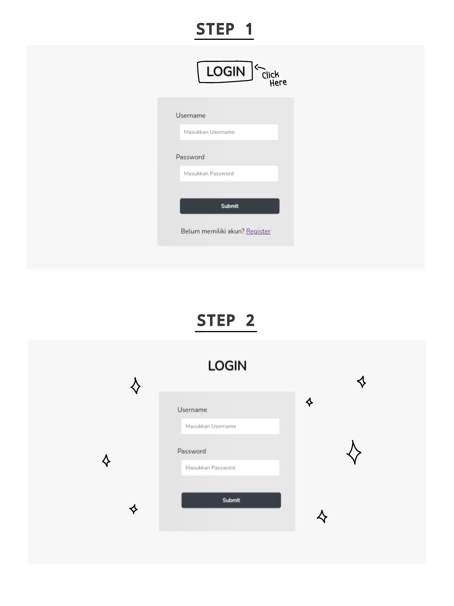

<!-- README Referensi: https://github.com/othneildrew/Best-README-Template/ -->

  

  <h3>FLUFFY CAFE MENU'S WEBSITE</h3>
  

    <!-- <i>deskripsi</i> -->
     
    <a href="https://github.com/Natalieefd/cafe-menu.git"><strong>Go To Project  »</strong></a>  
  

  

  

    Website Link
     ↓↓ 
    <a href="http://www.fluffycafe.byethost7.com/">Go To Website</a>
     
    

    <h3>Login Information</h3>
      
  

  

    <ul>
      <li><b>Admin</b>  Username : admin Password : admin</li>
       
      <li><b>Staff</b>  Username : staff Password : staff</li>
       
      <li><b>Customer</b>  Username : natalie Password : natalie</li>
    </ul>
  

    
  
⋮<a href="#top"> Back to top </a>⋮

  

  <h3 align="center">Website Feature Information</h3>
    
  

    <b>Admin Feature</b>
    <ul>
      <li>Admin Login</li>
      <li>Admin Dashboard</li>
      <li>CRUD Staff Account</li>
      <li>CRUD Menu</li>
      <li>View Menu</li>
      <li>View Staff Attendace</li>
      <li>View Customer Account</li>
      <li>Logout</li>
    </ul>
      
    <b>Staff Feature</b>
    <ul>
      <li>Staff Login</li>
      <li>Staff Home Page</li>
      <li>Online Absence Attendace</li>
      <li>View Menu</li>
      <li>Logout</li>
    </ul>
      
    <b>Customer Feature</b>
    <ul>
      <li>Customer Login</li>
      <li>Add New Account</li>
      <li>Customer Home Page</li>
      <li>View Menu</li>
      <li>Add Menu Favorite</li>
      <li>Delete Menu Favorite</li>
      <li>View Menu Favorite</li>
      <li>Logout</li>
    </ul>
  

    
  
⋮<a href="#top"> Back to top </a>⋮

  

  <h3><b>Website Preview</b></h3>
   
  

    ——————————————————————————————————— 
    <b><i>Home Page</i></b> 
    ——————————————————————————————————— 
  

  
     
  

    ——————————————————————————————————— 
    <b><i>Login Customer Page</i></b> 
    ——————————————————————————————————— 
  

  
     
  

    ——————————————————————————————————— 
    <b><i>Login Staff Page</i></b> 
    ——————————————————————————————————— 
  

  
  

    
    <i>*Untuk masuk ke page login staff klik teks 'LOGIN' pada page login customer</i>
  

     
  

    ——————————————————————————————————— 
    <b><i>Login Admin Page</i></b> 
    ——————————————————————————————————— 
  

  
  

    
    <i>*Untuk masuk ke page login admin klik teks 'LOGIN' pada page login staff</i>
  

     
  

    ——————————————————————————————————— 
    <b><i>Staff Home Page</i></b> 
    ——————————————————————————————————— 
  

  
     
  

    ——————————————————————————————————— 
    <b><i>Admin Home Page</i></b> 
    ——————————————————————————————————— 
  

  
   

  

⋮<a href="#top"> Back to top </a>⋮

