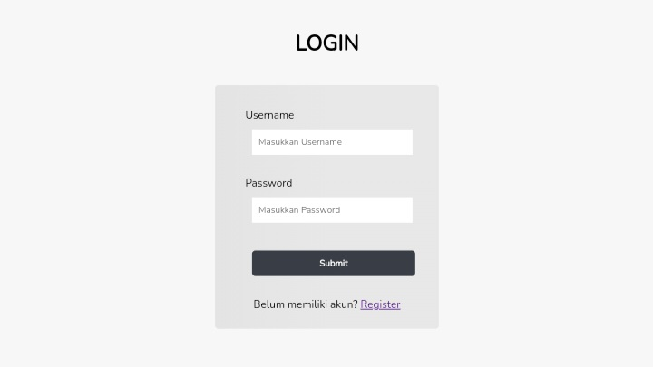

<!-- README Referensi: https://github.com/othneildrew/Best-README-Template/ -->

  

  <h3>FLUFFY CAFE MENU'S WEBSITE</h3>
  

    <!-- <i>deskripsi</i> -->
     
    <a href="https://github.com/Natalieefd/cafe-menu.git"><strong>Go To Project  »</strong></a>  
  

  

  

    Website Link
     ↓↓ 
    <a href="http://www.fluffycafe.byethost7.com/">Go To Website</a>
      
  

  

    <ul>
      <li><b>Admin</b>  Username : admin Password : admin</li>
       
      <li><b>Staff</b>  Username : staff Password : staff</li>
       
      <li><b>Customer</b>  Username : natalie Password : natalie</li>
    </ul>
  

    
  
≬<a href="#top"> Back to top </a>≬

  

  <h2><b>Website Preview</b></h2>
   
  <h3><i>Home Page</i></h3>
  
    
  <h3><i>Login Customer Page</i></h3>
  

  

≬<a href="#top"> Back to top </a>≬

